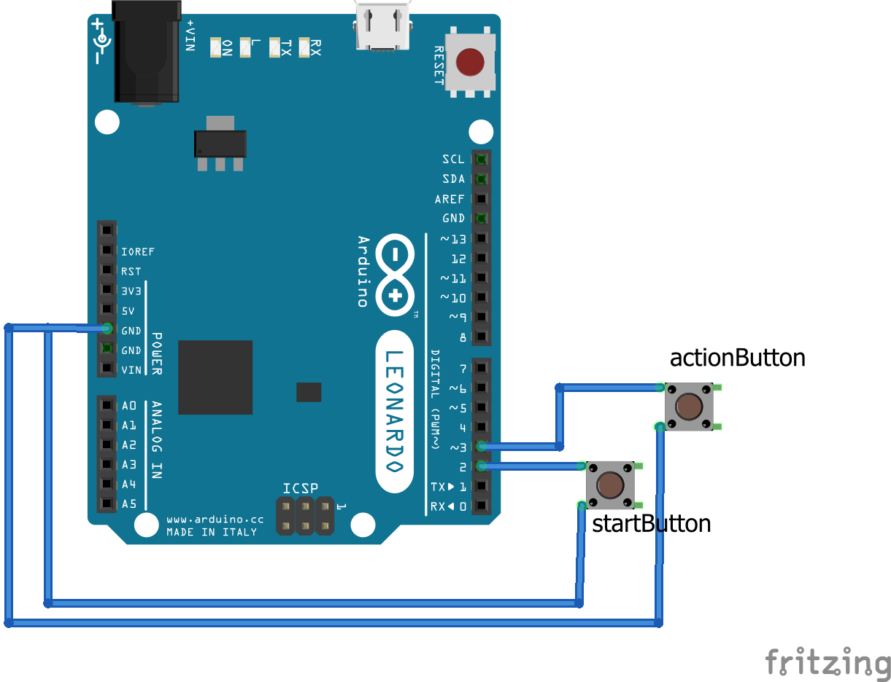

# Clicker Games for Arduino

## Faster Clicker

Small Arduino project to measure how fast you can click a button.

Push the button as quickly as possible when the LED lits up.

### Code

I wrote 3 versions of the game:
* one version using no external dependencies at all
* one version using [Button](https://github.com/rmorenojr/Button) library
* one version using [AceButton](https://github.com/bxparks/AceButton/) library

I wanted to see how much memory a library would use, because memory is kind of small on some Arduinos, and that's something to keep in mind if the program is large. Here, we have plenty of memory left, but that game is really simple and uses only 2 buttons. This would increase a lot if we're using multiple libraries, more inputs and more complex program code.

Here are the respective results from the 3 versions:
* Program storage space: 5530 bytes (19%) - Dynamic memory: 257 bytes (10%)
* Program storage space: 5864 bytes (20%) - Dynamic memory: 325 bytes (12%)
* Program storage space: 6798 bytes (23%) - Dynamic memory: 345 bytes (13%)

The lesson here is that using external libs is nice and helps a lot, but some might be too big for our use. In our case, AceButton is requiring too much memory for what we need to do. Sure, it has a lot of features and the code is quite clean, but I don't think it's worth using it if you just need a library that detects button presses and has debounce.

### Schematics

I've included schematics for this experiment as the Fritzing file as well. [Frizing](http://www.fritzing.org/) is an open source hardware initiative, and they made a really nice and [open source software](https://github.com/fritzing/fritzing-app) to create electronic schematics.

## FrenzyClicker

More to come 😉

## Licensing

GNU GPLv3 copyright (c) LouWii